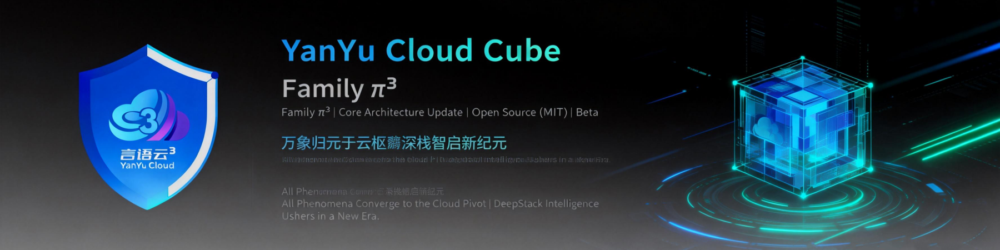

<!--
  YYC³ NemoClaw — OpenShell 沙箱化 AI 智能体参考技术栈
  Copyright (c) 2026 YYC³ AI Family. All rights reserved.
  SPDX-License-Identifier: Apache-2.0
-->

<p align="center">
  
</p>

<p align="center">
  <a href="https://claw.yyc3.vip">
    
  </a>
  <a href="https://github.com/YYC-Cube/YYC3-NemoClaw">
    
  </a>
</p>

<p align="center">
  <a href="https://github.com/YYC-Cube/YYC3-NemoClaw/blob/main/LICENSE">
    
  </a>
  <a href="https://github.com/YYC-Cube/YYC3-NemoClaw/actions">
    
  </a>
  <a href="https://github.com/YYC-Cube/YYC3-NemoClaw/releases">
    
  </a>
  <a href="https://github.com/YYC-Cube/YYC3-NemoClaw/issues">
    
  </a>
  <a href="https://github.com/YYC-Cube/YYC3-NemoClaw/security">
    
  </a>
  
  
</p>

<p align="center">
  <a href="#中文">
    
  </a>
  <a href="#english">
    
  </a>
</p>

---

<h1 id="中文">YYC³ NemoClaw</h1>

> **言启千行代码，语枢万物智能**
>
> OpenShell 沙箱化 AI 智能体参考技术栈 — 安全、可靠、智能

## 概述

YYC³ NemoClaw 是基于 [NVIDIA OpenShell](https://github.com/NVIDIA/OpenShell) 的开源参考技术栈，用于在沙箱环境中更安全地运行常驻 AI 智能体。通过单一 CLI 提供引导式部署、强化蓝图、路由推理、网络策略和全生命周期管理。

现已集成 `@yyc3/i18n-core`，全面支持 **中文（zh-CN）本地化**。

### 核心特性

| 特性　　　　　　　| 说明　　　　　　　　　　　　　　　　　　　　　　　　|
| -------------------| -----------------------------------------------------|
| **沙箱隔离**　　　| Landlock 文件系统 + Seccomp 系统调用 + 网络命名空间 |
| **推理路由**　　　| `inference.local` → Policy Proxy → 外部提供商　　　 |
| **凭证隔离**　　　| 网关存储真实密钥，沙箱仅接收占位符　　　　　　　　　|
| **策略引擎**　　　| OPA 策略 + mTLS 认证 + 预设模板　　　　　　　　　　 |
| **蓝图版本化**　　| YAML 蓝图 + 镜像摘要校验 + 版本约束　　　　　　　　 |
| **i18n 国际化**　 | `@yyc3/i18n-core` 自动中英文切换　　　　　　　　　　|
| **YYC³ 本地推理** | DGX Spark Ollama / Mac MLX / vLLM 三路推理　　　　　|

### 支持的智能体

- [OpenClaw](https://openclaw.ai)（默认）— Node.js AI 智能体，端口 18789
- [Hermes](https://get-hermes.ai/) — Python AI 智能体，API 端口 8642，Dashboard 端口 9119
- **YYC³ AI Family** — 自研智能体体系（规划中）

## 快速开始

### 前置条件

| 要求 | 说明 |
|------|------|
| **操作系统** | macOS / Linux / WSL2 |
| **运行时** | Node.js ≥ 20 |
| **容器** | Docker / Podman |
| **推理** | 本地 Ollama 或远程 API |

### 安装

```bash
# 一键安装
curl -fsSL https://raw.githubusercontent.com/YYC-Cube/YYC3-NemoClaw/main/install.sh | bash

# 或使用 npm
npm install -g @yyc3/nemoclaw
```

### 部署智能体

```bash
# OpenClaw（默认）
nemoclaw onboard

# Hermes
NEMOCLAW_AGENT=hermes nemoclaw onboard

# 中文环境自动切换
export LANG=zh_CN.UTF-8
nemoclaw help
```

## YYC³ 本地推理

| Profile       | 端点　　　　　　　　　| 模型　　　　　　　　　　　| 基座　　　　　　　　| 设备　　　　 |
| ---------------| -----------------------| ---------------------------| ---------------------| --------------|
| `yyc3-ollama` | `192.168.3.101:11434` | `qwen3.6:35b-a3b`　　　　 | Qwen3.6-35B-A3B　　 | DGX Spark N1 |
| `yyc3-coder`  | `192.168.3.101:11434` | `yyc3-coder-v1:latest`　　| Qwen3-14B　　　　　 | DGX Spark N1 |
| `yyc3-mgmt`   | `192.168.3.101:11434` | `yyc3-mgmt-v2:latest`　　 | Qwen3.6-27B　　　　 | DGX Spark N1 |
| `yyc3-mlx`    | `192.168.3.22:25603`　| `Family/Coder/v0.2.0+mlx` | Qwen3-14B　　　　　 | Mac M4 Max　 |
| `yyc3-vllm`   | `192.168.3.102:11434` | `qwen3-coder-30b-a3b-q4`　| Qwen3-Coder-30B-A3B | DGX Spark N2 |

```bash
# 使用 YYC³ 本地推理
nemoclaw <sandbox> inference set --profile yyc3-ollama
```

## i18n 国际化

集成 `@yyc3/i18n-core`，根据系统语言环境自动切换。

| 特性 | 说明 |
|------|------|
| **自动检测** | `LANG`/`LC_ALL` 环境变量自动选择 `zh-CN` 或 `en` |
| **嵌套键名** | `t("brand.tagline")` 支持点号分隔深层路径 |
| **插值参数** | `t("help.lockConfig", { cli: "nemoclaw" })` 支持 `{param}` |
| **回退链** | zh-CN → en → 原始键名 → 自定义回退 |

```bash
export LANG=zh_CN.UTF-8  # 中文
export LANG=en_US.UTF-8  # English
```

## 架构

```
┌─────────────────────────────────────────────┐
│              YYC³ NemoClaw CLI               │
│         (onboard / deploy / manage)          │
├─────────────────────────────────────────────┤
│           OpenShell Gateway + Policy         │
│     (Landlock / Seccomp / NetNS / OPA)      │
├──────────────┬──────────────┬───────────────┤
│   OpenClaw   │    Hermes    │  YYC³ Agent   │
│  (Node.js)   │  (Python)    │  (自研规划中)   │
├──────────────┴──────────────┴───────────────┤
│          推理路由 (inference.local)           │
│   DGX Ollama │ Mac MLX │ vLLM │ Remote API  │
└─────────────────────────────────────────────┘
```

## 文档

| 页面 | 说明 |
|------|------|
| [概述](https://docs.nvidia.com/nemoclaw/latest/about/overview.html) | NemoClaw 功能及整体架构 |
| [架构概览](https://docs.nvidia.com/nemoclaw/latest/about/how-it-works.html) | Plugin、蓝图、沙箱生命周期 |
| [生态系统](https://docs.nvidia.com/nemoclaw/latest/about/ecosystem.html) | OpenClaw / OpenShell / NemoClaw 技术栈 |
| [前置条件](https://docs.nvidia.com/nemoclaw/latest/get-started/prerequisites.html) | 硬件、软件和平台支持 |
| [推理选项](https://docs.nvidia.com/nemoclaw/latest/inference/inference-options.html) | 提供商、验证和路由配置 |
| [网络策略](https://docs.nvidia.com/nemoclaw/latest/reference/network-policies.html) | 基准规则、出口控制 |
| [安全最佳实践](https://docs.nvidia.com/nemoclaw/latest/security/best-practices.html) | 安全控制、风险框架 |
| [CLI 命令](https://docs.nvidia.com/nemoclaw/latest/reference/commands.html) | 完整命令参考 |
| [故障排查](https://docs.nvidia.com/nemoclaw/latest/reference/troubleshooting.html) | 常见问题及解决方案 |

## 设备矩阵

| 设备 | 主机名 | IP | 角色 |
|------|--------|-----|------|
| MacBook M4 Max (128GB) | yyc3-22 | 192.168.3.22 | 主控 / 微调 / MLX 推理 |
| DGX Spark N1 (121GB) | yyc3-101 | 192.168.3.101 | GPU 推理 / Ollama |
| DGX Spark N2 (121GB) | yyc3-102 | 192.168.3.102 | Embedding / Reranker / LoRA |
| iMac M4 (32GB) | yyc3-77 | 192.168.3.77 | 辅助运维 |
| NAS F4-423 | yyc3-45 | 192.168.3.45 | 存储 / PostgreSQL |
| 阿里云 ECS | yyc3-33 | 39.97.53.176 | API 服务 / 网关 |

## 社区

| 需求 | 渠道 |
|------|------|
| 安装或使用问题 | [GitHub Discussions](https://github.com/YYC-Cube/YYC3-NemoClaw/discussions) |
| Bug 报告 | [GitHub Issues](https://github.com/YYC-Cube/YYC3-NemoClaw/issues) |
| 功能提案 | [GitHub Discussions](https://github.com/YYC-Cube/YYC3-NemoClaw/discussions) |
| 安全漏洞 | [SECURITY.md](SECURITY.md) 私有渠道 |

## 贡献

欢迎贡献。请参阅 [CONTRIBUTING.md](CONTRIBUTING.md) 了解开发环境搭建、编码标准和 PR 流程。

## 许可证

Apache 2.0。详见 [LICENSE](LICENSE)。

---

<h1 id="english">YYC³ NemoClaw</h1>

> **Words inspire thousands of lines of code, language pivots the intelligence of all things**
>
> Reference Stack for Sandboxed AI Agents in OpenShell — Secure, Reliable, Intelligent

## Overview

YYC³ NemoClaw is an open-source reference stack based on [NVIDIA OpenShell](https://github.com/NVIDIA/OpenShell) for running always-on AI agents more safely inside sandboxes. It provides guided onboarding, hardened blueprints, routed inference, network policies, and full lifecycle management through a single CLI.

Now integrated with `@yyc3/i18n-core` for full **Chinese (zh-CN) localization** support.

### Key Features

| Feature | Description |
|---------|-------------|
| **Sandbox Isolation** | Landlock FS + Seccomp syscalls + Network namespaces |
| **Inference Routing** | `inference.local` → Policy Proxy → External providers |
| **Credential Isolation** | Gateway stores real keys, sandbox receives placeholders |
| **Policy Engine** | OPA policies + mTLS auth + preset templates |
| **Blueprint Versioning** | YAML blueprints + image digest verification |
| **i18n** | `@yyc3/i18n-core` auto Chinese/English switching |
| **YYC³ Local Inference** | DGX Spark Ollama / Mac MLX / vLLM triple routing |

### Supported Agents

- [OpenClaw](https://openclaw.ai) (default) — Node.js AI agent, port 18789
- [Hermes](https://get-hermes.ai/) — Python AI agent, API port 8642, Dashboard port 9119
- **YYC³ AI Family** — Custom agent system (in development)

## Quick Start

### Prerequisites

| Requirement | Description |
|-------------|-------------|
| **OS** | macOS / Linux / WSL2 |
| **Runtime** | Node.js ≥ 20 |
| **Container** | Docker / Podman |
| **Inference** | Local Ollama or Remote API |

### Install

```bash
# One-click install
curl -fsSL https://raw.githubusercontent.com/YYC-Cube/YYC3-NemoClaw/main/install.sh | bash

# Or via npm
npm install -g @yyc3/nemoclaw
```

### Deploy Agent

```bash
# OpenClaw (default)
nemoclaw onboard

# Hermes
NEMOCLAW_AGENT=hermes nemoclaw onboard

# Chinese locale auto-switch
export LANG=zh_CN.UTF-8
nemoclaw help
```

## YYC³ Local Inference

| Profile | Endpoint | Model | Device |
|---------|----------|-------|--------|
| `yyc3-ollama` | `192.168.3.101:11434` | `qwen3.6:35b-a3b` | DGX Spark N1 |
| `yyc3-mlx` | `192.168.3.22:25603` | `Family/Coder/v0.2.0+mlx` | Mac M4 Max |
| `yyc3-vllm` | `192.168.3.102:11434` | `qwen3-coder-30b-a3b-q4` | DGX Spark N2 |

```bash
# Use YYC³ local inference
nemoclaw <sandbox> inference set --profile yyc3-ollama
```

## i18n Internationalization

Integrated `@yyc3/i18n-core` for automatic locale-based language switching.

| Feature | Description |
|---------|-------------|
| **Auto-detection** | `LANG`/`LC_ALL` env vars auto-select `zh-CN` or `en` |
| **Nested keys** | `t("brand.tagline")` supports dot-delimited deep paths |
| **Interpolation** | `t("help.lockConfig", { cli: "nemoclaw" })` supports `{param}` |
| **Fallback chain** | zh-CN → en → raw key → custom fallback |

## Architecture

```
┌─────────────────────────────────────────────┐
│              YYC³ NemoClaw CLI               │
│         (onboard / deploy / manage)          │
├─────────────────────────────────────────────┤
│           OpenShell Gateway + Policy         │
│     (Landlock / Seccomp / NetNS / OPA)      │
├──────────────┬──────────────┬───────────────┤
│   OpenClaw   │    Hermes    │  YYC³ Agent   │
│  (Node.js)   │  (Python)    │  (planned)    │
├──────────────┴──────────────┴───────────────┤
│          Inference Router (inference.local)  │
│   DGX Ollama │ Mac MLX │ vLLM │ Remote API  │
└─────────────────────────────────────────────┘
```

## Documentation

| Page | Description |
|------|-------------|
| [Overview](https://docs.nvidia.com/nemoclaw/latest/about/overview.html) | What NemoClaw does and how it fits together |
| [Architecture](https://docs.nvidia.com/nemoclaw/latest/about/how-it-works.html) | Plugin, blueprint, sandbox lifecycle |
| [Ecosystem](https://docs.nvidia.com/nemoclaw/latest/about/ecosystem.html) | OpenClaw / OpenShell / NemoClaw stack |
| [Prerequisites](https://docs.nvidia.com/nemoclaw/latest/get-started/prerequisites.html) | Hardware, software, and supported platforms |
| [Inference](https://docs.nvidia.com/nemoclaw/latest/inference/inference-options.html) | Providers, validation, routed inference |
| [Network Policies](https://docs.nvidia.com/nemoclaw/latest/reference/network-policies.html) | Baseline rules, egress control |
| [Security](https://docs.nvidia.com/nemoclaw/latest/security/best-practices.html) | Controls, risk framework |
| [CLI Commands](https://docs.nvidia.com/nemoclaw/latest/reference/commands.html) | Full command reference |
| [Troubleshooting](https://docs.nvidia.com/nemoclaw/latest/reference/troubleshooting.html) | Common issues and solutions |

## Device Matrix

| Device | Hostname | IP | Role |
|--------|----------|-----|------|
| MacBook M4 Max (128GB) | yyc3-22 | 192.168.3.22 | Main / Fine-tune / MLX |
| DGX Spark N1 (121GB) | yyc3-101 | 192.168.3.101 | GPU / Ollama |
| DGX Spark N2 (121GB) | yyc3-102 | 192.168.3.102 | Embedding / Reranker / LoRA |
| iMac M4 (32GB) | yyc3-77 | 192.168.3.77 | Ops |
| NAS F4-423 | yyc3-45 | 192.168.3.45 | Storage / PostgreSQL |
| Alibaba ECS | yyc3-33 | 39.97.53.176 | API / Gateway |

## Community

| Need | Channel |
|------|---------|
| Setup or usage questions | [GitHub Discussions](https://github.com/YYC-Cube/YYC3-NemoClaw/discussions) |
| Bug reports | [GitHub Issues](https://github.com/YYC-Cube/YYC3-NemoClaw/issues) |
| Feature proposals | [GitHub Discussions](https://github.com/YYC-Cube/YYC3-NemoClaw/discussions) |
| Security vulnerabilities | Private channels in [SECURITY.md](SECURITY.md) |

## Contributing

We welcome contributions. See [CONTRIBUTING.md](CONTRIBUTING.md) for development setup, coding standards, and the PR process.

## License

Apache 2.0. See [LICENSE](LICENSE).
